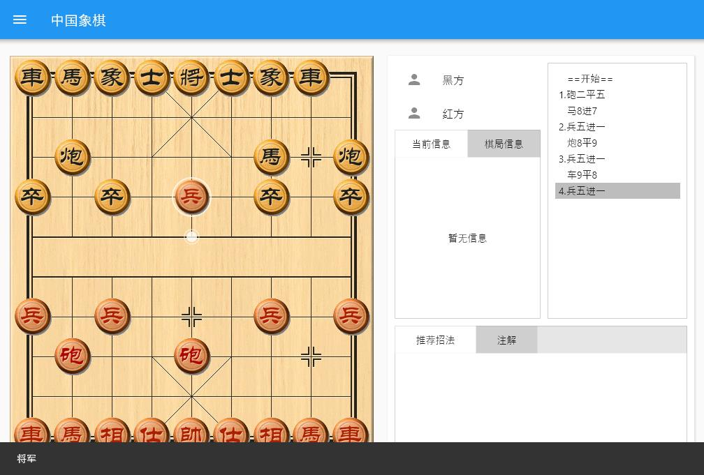
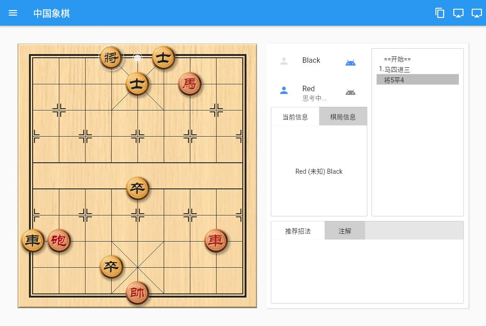
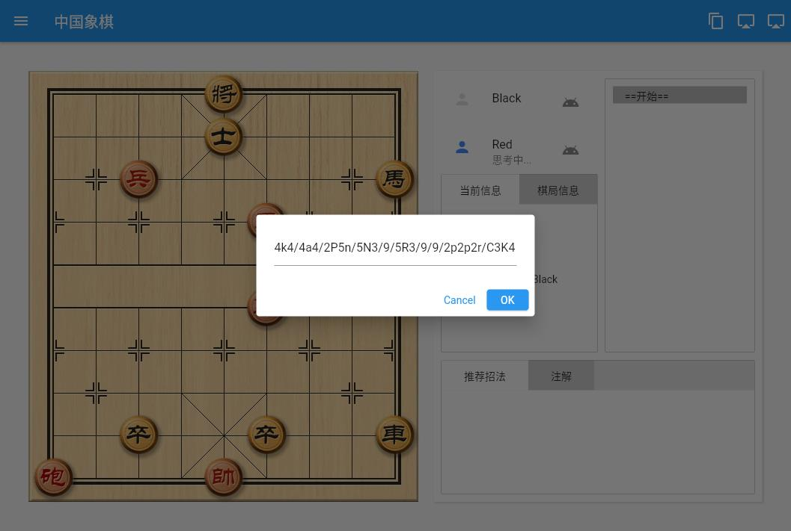
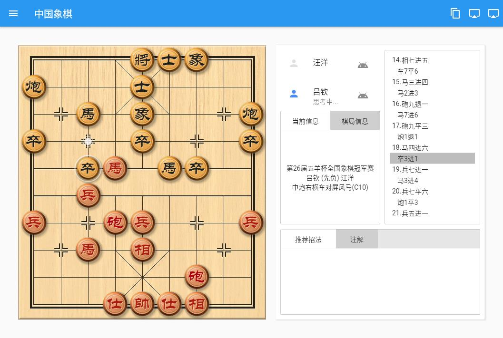
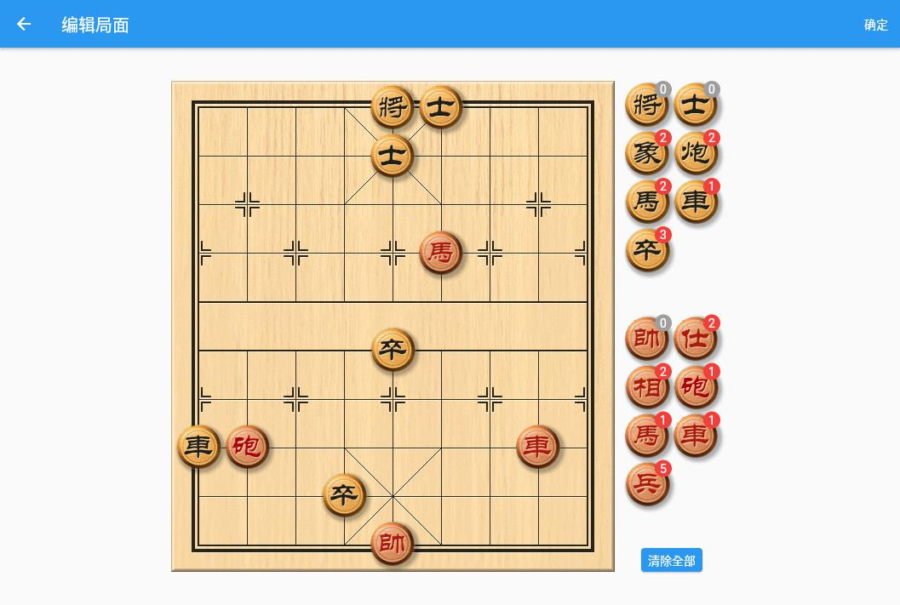
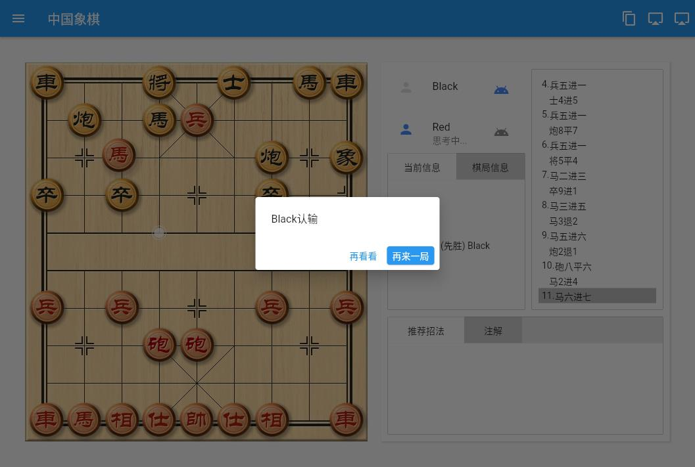

# Cờ Tướng (Chinese Chess)

Giao diện cờ tướng. Cung cấp xử lý luật chơi đầy đủ, phiên bản Windows tích hợp engine [elephanteye](https://www.xqbase.com/league/elephanteye.htm) để gợi ý nước đi. 

*** Lưu ý quan trọng: Dự án này chỉ dùng cho mục đích học tập, nghiên cứu. Tài nguyên hình ảnh/âm thanh lấy từ Tượng Kỳ Tiểu Phù Sĩ, engine tích hợp được dịch từ xqlite(js), vui lòng không sử dụng các tài nguyên này cho dự án thương mại. ***

## Tính Năng

- [x] Xử lý luật chơi. Bao gồm gợi ý điểm đặt quân, chiếu tướng, phải đỡ chiếu, phát hiện thắng/thua
- [x] Tải skin bàn cờ và quân cờ
- [x] Hỗ trợ tải định dạng PGN, nhập định dạng FEN
- [x] Xuất định dạng PGN, sao chép thế cờ dạng FEN
- [ ] Tự động phát lại kỳ phổ
- [x] Hỗ trợ đa ngôn ngữ
- [x] Thêm hiệu ứng âm thanh (tạm thời không hỗ trợ Linux)
- [x] Hiển thị thông tin ván đấu
- [x] Chỉnh sửa thế cờ
- [x] Thêm máy tính đánh ngẫu nhiên (máy tích hợp đã cập nhật thành Tượng Kỳ Tiểu Phù Sĩ)
- [ ] Kiểm soát thời gian ván đấu
- [ ] Đấu trực tuyến

## Giao Diện
- [ ] Cải thiện giao diện
- [x] Hỗ trợ phiên bản Windows
- [x] Hỗ trợ phiên bản Web
- [x] Hỗ trợ phiên bản Android
- [ ] Hỗ trợ phiên bản iOS
- [x] Hỗ trợ phiên bản MacOS
- [ ] Hỗ trợ phiên bản Linux

## Vấn Đề Đã Biết

* [Đang tối ưu] Phiên bản Web dùng máy tính đánh ngẫu nhiên tích hợp, chỉ để giải trí 
    * Tra cứu nước đi từ khai cuộc
    * Tăng độ sâu phân tích cho trung cuộc và tàn cuộc
    * Tối ưu thuật toán tính trọng số nước đi
* [Đã giải quyết] Một số trường hợp không thể phán định kết thúc ván đấu chính xác
* [Đã giải quyết] Phiên bản Windows dùng elephanteye, nếu có cửa sổ ele đang mở, thu nhỏ nó lại là được
* [Đã giải quyết] Phiên bản Windows: máy tính và gợi ý người dùng dùng chung một engine, đôi khi xảy ra xung đột nước đi
* Ngoài phiên bản Windows, các nền tảng khác không tích hợp engine elephanteye nên không có chức năng phân tích nước đi, chỉ có máy tính xqlite tích hợp

## Xem Trước
Giao diện bàn cờ và quân cờ lấy từ tài nguyên của Tượng Kỳ Tiểu Phù Sĩ 
[Xem trước phiên bản Web](https://www.shirne.com/demo/chinesechess/) (Phiên bản Web cần tải canvaskit, mở hơi chậm)
|Chiếu Tướng|Máy Tính Web|
|:---:|:---:|
|||
|Dán Mã Thế Cờ|Xem Kỳ Phổ|
|||
|Chỉnh Sửa Thế Cờ|Kết Quả|
|||

## Phát Triển Bằng Flutter

Đây là điểm khởi đầu cho một ứng dụng Flutter.

Một số tài nguyên giúp bạn bắt đầu nếu đây là dự án Flutter đầu tiên của bạn:

- [Thực hành: Viết ứng dụng Flutter đầu tiên](https://flutter.dev/docs/get-started/codelab)
- [Cookbook: Các mẫu Flutter hữu ích](https://flutter.dev/docs/cookbook)

Để được trợ giúp bắt đầu với Flutter, hãy xem
[tài liệu trực tuyến](https://flutter.dev/docs), cung cấp hướng dẫn, ví dụ, hướng dẫn phát triển di động và tài liệu API đầy đủ.

## Tài Liệu Tham Khảo
* [ECCO] https://www.xqbase.com/ecco/ecco_contents.htm#ecco_a
* [UCCI] https://www.xqbase.com/protocol/cchess_ucci.htm
* [Ký hiệu nước đi] https://www.xqbase.com/protocol/cchess_move.htm
* [Định dạng FEN] https://www.xqbase.com/protocol/cchess_fen.htm
* [Định dạng PGN] https://www.xqbase.com/protocol/cchess_pgn.htm

## Nhật Ký Thay Đổi

* 20210509 Trang cài đặt, tối ưu chức năng, máy tính tích hợp được dịch từ [Tượng Kỳ Tiểu Phù Sĩ](https://github.com/xqbase/eleeye)

* 20210504 Chức năng chỉnh sửa thế cờ, nhiều cải tiến chi tiết

* 20210430 Thông báo kết quả, tải kỳ phổ, phán định bị bí

* 20210429 Tái cấu trúc bố cục, cải tiến thuật toán di chuyển; tải skin; phán định chiếu tướng, phải đỡ chiếu, và tự đưa vào thế chiếu

* 20210426 Luật di chuyển, hiệu ứng chuyển động
* 20210425 Hoàn thiện giao diện, di chuyển quân, ăn quân